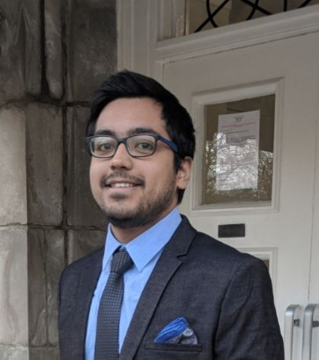

# Critical Information {-}

This is the Fall 2018 syllabus for PQHS / CRSP / MPHP 431: Statistical Methods in Biological & Medical Sciences, Section 1. 

## Course Home Page {-}

The course home page, with everything you'll need, is at https://github.com/THOMASELOVE/431-2018

## Working with This Document {-}

1. This document is broken down into multiple sections. Use the table of contents at left to navigate. 
2. At the top of the document, you'll see icons which you can click to 
    - search the document, 
    - change the size, font or color scheme of the page, and 
    - download a PDF or EPUB (Kindle-readable) version of the entire document.
3. The document is updated occasionally through the semester. Check the Version information above to verify the last update time.

## Who, When and Where? {-}

- Section 1 is taught by Professor Thomas Love. [More on him here][Dr. Love]. 
- The Fall 2018 teaching assistants are Bob Winkelman, Satyakam Mishra, Claudia Cabrera and Maher Kazimi. [More on them here][Teaching Assistants].
- Once the semester begins, reach us at **431-help at case dot edu**. 
- The course is given on Tuesdays and Thursdays from 1:00 to 2:15 PM, in Room E321-323 in the Robbins building at the School of Medicine.
- The first class is Tuesday 2018-08-28.

## Getting Help! {-}

To get help for anything related to the course, email **431-help at case dot edu**.

- Dr. Love is available on Tuesdays and Thursdays at CWRU, by appointment. To make an appointment, email him at `thomas.love@case.edu`. He is usually available for the 15 minutes before and the 30 minutes after class for drop-in conversations. If he's not in the classroom during those times, his office is on the ground floor of the Wood building, WG-82 L.
    + If you have any special concerns about the course, need special accommodations or have any other issues for Dr. Love, please email or stop by before or after class.
- TA office hours are held on the ground floor of the Wood building, in the computing lab (WG-56) or the student lounge (WG-67). The schedule is:

Day | Time
-------: | ----------------------
Tuesdays | 11:30 AM to 12:45 PM
Wednesdays | 12:00 noon to 1:30 PM
Thursdays | 11:30 AM to 12:45 PM, 2:30 to 4 PM, 5:30 - 7 PM
Fridays | 10:30 AM to Noon


## What Do I Need To Buy? {-}

We'll read two books that you'll need to purchase (the combined price is about \$25.):

1. Nate Silver's *The Signal and The Noise*. ISBN-13: 978-1594204111 [Amazon Link](https://www.amazon.com/Signal-Noise-Many-Predictions-Fail-but/dp/0143125087), and 
2. Jeff Leek's *The Elements of Data Analytic Style*, available at https://leanpub.com/datastyle.

Everything else that you will need is free, and is described in the remainder of this syllabus.


```{r cwrulogo-fig, echo = FALSE, out.width = '20%'}
knitr::include_graphics("figures/cwru-stacked-logo-blue-no-tag.jpg")
```

# Course Description

PQHS 431 (cross-listed as CRSP 431 and MPHP 431) is the first half of a two-semester sequence (with 432) focused on modern data analysis and advanced statistical modeling, with a practical bent and as little theory as possible. We emphasize the key role of thinking hard, and well, about design and analysis in research. 

The course is formally titled *Statistical Methods in Biological & Medical Sciences, Part 1.* A more accurate title is **Data Science for Biological, Medical or Health Research**.

We'll learn about managing and visualizing data, building models and making predictions, and other data science activities. This highly applied course focuses on modern tools for learning from data. We'll learn a lot of R, and we'll use R Studio and R Markdown as tools to help make R work better, and help perform our research in replicable ways.

## What Students Should Expect

During the 431-432 sequence, students will:

1. Use modern data science tools to import, tidy/manage, explore (through transformation, visualization and modeling) and communicate about data.
2. Think hard and well about design and analysis in scientific research.
3. Gain sufficient background in the practical issues regarding linear and generalized linear models to give you a starting place for meaningful applied work, particularly in terms of making comparisons to address general types of statistical and analytic questions (exploratory, predictive, inferential, and causal, in particular.)
4. Learn about the importance of replicable research, and develop facility and practice in open source tools for doing it.
5. Complete a series of assignments, including homeworks and quizzes on data provided for you, and course projects using data you select/develop. 
6. Program ("Code") in R sufficiently to accomplish the tasks above, with enough self-sufficiency afterwards to be able to debug and use new R tools without substantial troubleshooting help. What separates "doing data science" from "doing data analysis" is programming.

## 431 Class Outline

The 431 course **calendar** is linked at https://github.com/THOMASELOVE/431-2018. Go there for details on each class throughout the semester. 

The course is split in three parts. 

**Part A** (Classes 2-10) is mostly about R and Visualizing Data. 

- Exploratory Data Analysis
    - Descriptive Numerical and Graphical Summaries
    - Distributions, specifically the Normal
    - Histograms and their cousins
    - Scatterplots and related tools from correlation and linear regression
- Exploring Data with the Tidyverse, Getting Up To Speed with R
    - Visualizing Data with `ggplot2`
    - Data Transformation and `dplyr`
    - Using scripts and projects, Building Code
    
**Part B** (which starts around Class 11) is about Making Comparisons. 

- Estimation and Inference for Means and Proportions
    - Confidence Intervals
    - Design Implications: Matched vs. Independent Samples
    - Hypothesis Testing Strategies
    - Cross-Tabulations
    - Dealing with Missing Data
    - Randomized Trials vs. Non-Randomized Studies

**Part C** (which starts around Class 16) is about Building Regression Models. 

- Estimation and Inference using Ordinary Least Squares
    - Categorical Variables, Analysis of Variance
    - Simple and Multivariate Linear Regression Models
    - Building Prediction Models, and Validating Them
    - Analysis of Covariance
    - Residual and Influence Analyses
    - Foundations of Model / Feature / Variable Selection

## Key Topics in 431 and 432

1. Exploratory Data Analysis: "All graphs are comparisons" including data exploration, statistical graphics and more general visualization of information.
2. Placing biological, medical and health research questions into a statistical framework.
3. Study Development - making choices in designing and executing the collection and aggregation of data.
4. Data Handling - including important issues in importing, tidying and transforming data, as well as methods for dealing with missing data, including imputation.
5. Statistical Comparisons: "All of statistics are comparisons" - including methods for discrete and continuous variables: intervals, assumptions, some thoughts on statistical power, and the bootstrap, design of visualizations and models for rates, proportions and contingency tables.
6. The proper use of multi-predictor models for continuous and discrete data, including...
    - Fitting, evaluating, and interpreting linear and generalized linear models.
    - Prediction and validation.
    - Critical role of graphics, including diagnostics and residual analysis.
    - Model choice, including variable selection, shrinkage and model uncertainty.
    - Dealing with categorical predictors and interactions meaningfully.
    - Causal inference using regression: controlling for covariates meaningfully.
7. Using R and R Studio to make all of the things above happen; with particular emphasis on doing replicable research and using Markdown to document the work.

## What We Expect You To Know Already

Not much.

Useful prior experience includes training/experience in statistics, coding/programming and biology/biomedical science. We expect most people will have some experience in one or two of these areas, but very few will have all three.

- Some students have lots of prior training in statistics. But there are many students in the class with no statistical training at all that they use regularly. We assume only that everyone knows what an average is, and has some sense of why statistics might be useful to them in their chosen field.  
- Some students have lots of prior coding and programming experience, including experience with R. Some have never written a line of code in their life.  We assume only that everyone is willing to learn how to do modern work with data, and that means writing computer code, but that some people will be starting from nothing.
- Some students have lots of prior experience with biological and biomedical science, and know a lot of useful things in those areas which relate directly to our work. Others have zero experience in this area, and will learn a lot from their colleagues. We assume only that everyone is willing to learn, and to put in some effort to do so.

People succeed in this course with a wide range of backgrounds and a common interest in using data effectively in research related to biology, health or medicine. There will be multiple people in the class who are years away from their last statistics class. We expect the majority of students will have no prior experience using R, or any meaningful recollection of using statistical software. 

The pace can be brisk at times, but all CWRU students who feel up to it are welcome, regardless of their field of study or prior experience.

# Dr. Love

```{r Lovepic-fig, echo = FALSE, out.width = '50%'}
knitr::include_graphics("figures/Love2018.jpg")
```

Thomas E. Love, Ph.D.

- Professor of Medicine, Population and Quantitative Health Sciences, [CWRU](http://case.edu/)
- Director of [Biostatistics and Evaluation](http://chrp.org/biostatistics-evaluation/), [Center for Health Care Research & Policy](http://chrp.org/), [MetroHealth Medical Center](https://www.metrohealth.org/research)
- [Chief Data Scientist](http://www.betterhealthpartnership.org/data_center/), [Better Health Partnership](http://betterhealthpartnership.org/)
- Track Lead for Health Care Analytics, MS in Biostatistics, [Department of Population and Quantitative Health Sciences](http://epbiwww.case.edu/), CWRU
- Fellow, [American Statistical Association](http://www.amstat.org/)

### Email {-}

- Email to get help with the course: **431-help at case dot edu** (seen by Professor Love and the TAs)
- `Thomas dot Love at case dot edu` (for matters related to grades or individual concerns)
- Dr. Love is hard to reach by phone. Email is always the best way to reach him.

### Offices {-}

- Wood WG-82L on the ground floor of the Wood building (Tuesdays and Thursdays)
- Rammelkamp R-229A at MetroHealth Medical Center (Wednesdays and Fridays)

Dr. Love is generally available for the 15 minutes before and the 30 minutes after each class, and otherwise by appointment on Tuesdays and Thursdays (send email to schedule). 

### Web {-}

- Dr. Love's [GitHub pages website](https://thomaselove.github.io/). 
    + His GitHub name is [THOMASELOVE](https://github.com/thomaselove).
- His Twitter handle is [ThomasELove](https://twitter.com/ThomasELove).

### A More Complete Biography {-}

Hi. I am Thomas E. Love, Ph.D. and I have at least three different jobs.

- I am a Professor in the Departments of Medicine and Population & Quantitative Health Sciences at Case Western Reserve University. I teach three courses per year there (PQHS 431, 432 and 500) and also lead the Health Care Analytics track of the MS program in Biostatistics.
- I direct [Biostatistics and Evaluation](http://chrp.org/biostatistics-evaluation/) at the [Center for Health Care Research & Policy](http://chrp.org/), which is a joint venture of CWRU and MetroHealth Medical Center.
- For ten years, I was the (founding) Data Director for [Better Health Partnership](http://betterhealthpartnership.org/), an alliance of people who provide, pay for and receive care in Northeast Ohio. I now serve as Chief Data Scientist there.
- I am a Fellow of the American Statistical Association, and have won numerous awards for my teaching and my research, including the 2018 [John S. Diekhoff Award for Graduate Teaching](https://students.case.edu/traditions/awards/diekhoff/) from CWRU.
- I have been teaching at CWRU since 1994, and have taught every manner of CWRU student over the years, especially students in biostatistics, medicine, and management.

In research, I use statistical methods to look at questions in health policy and in particular the provision of health services. I mostly work with observational data, rather than data that emerge from randomized clinical trials, and I have a special interest in working with data from electronic health records.

- You may be interested in a [recent study in Health Affairs](http://content.healthaffairs.org/content/34/7/1121.abstract) showing the impact of a [Medicaid-like expansion plan on care and outcomes of poor patients in Cleveland](http://thedaily.case.edu/new-study-shows-prepared-safety-net-improves-care-saves-money-in-medicaid-expansion-population/).
- Or you might be interested in our [New England Journal of Medicine study](http://www.nejm.org/doi/full/10.1056/NEJMsa1102519) of the effect of electronic health records on the care and outcomes of people with diabetes.
- In 2011, [James O'Malley](http://tdi.dartmouth.edu/faculty/a-james-omalley-phd) and I chaired the [Ninth International Conference on Health Policy Statistics](https://ww2.amstat.org/meetings/ichps/2011/index.cfm?fuseaction=main), here in Cleveland. Here's a [recap](https://link.springer.com/article/10.1007%2Fs10742-012-0096-8). 
- I've also worked on many projects involving the use of propensity scores to make causal inferences from observational studies, particularly in heart failure.

If you want to see a [pretty complete list of my publications](https://www.ncbi.nlm.nih.gov/myncbi/browse/collection/48415155/?sort=date&direction=ascending), knock yourself out. 

I hold degrees from Columbia University in the City of New York and from the University of Pennsylvania. My dissertation adviser was Paul Rosenbaum. I am married to a brilliant woman who is an attorney downtown, and we are raising two terrific sons, who are sophomores in college and high school. I live in Shaker Heights. I also sing and act occasionally in [community theater](https://github.com/THOMASELOVE/theater).

# Teaching Assistants

Each of this year's stellar group of teaching assistants has been in your shoes - they've taken the course in the past, and they enjoyed it enough to come back for more. They are volunteering their precious time and energy to help make the course happen, and we couldn't be more delighted to welcome you to the course. There are two sections of this course (Section 1 with Dr. Love, and Section 2 with Dr. Li) but all TAs work with both sections.

To contact Dr. Love and the TAs, email **431-help at case dot edu**.

## Office Hours for TAs

Teaching Assistant Office Hours are held in WG-56 (Computing Lab) or WG-67 (Student Lounge) on the ground floor of the Wood building, so be sure to look in both places if you need help. 

TA Office Hours are held at the following times:

Day | Time
-------: | ----------------------
Tuesdays | 11:30 AM to 12:45 PM
Wednesdays | 12:00 noon to 1:30 PM
Thursdays | 11:30 AM to 12:45 PM, 2:30 to 4 PM, 5:30 - 7 PM
Fridays | 10:30 AM to Noon

This information is also available in the [Course Calendar](https://github.com/THOMASELOVE/431-2018/blob/master/calendar.md).

## Bob Winkelman

```{r Bobpic-fig, echo = FALSE, out.width = '33%'}
knitr::include_graphics("figures/Bob.jpg")
```

Bob Winkelman is a fourth year student in the M.D. program at the School of Medicine who is also enrolled in the M.S. program in Biostatistics. He received his undergraduate degree from Carnegie Mellon University where he majored in Chemical and Biomedical Engineering. Before coming to CWRU for medical school, Bob also worked for Epic, an electronic health record vendor, in Wisconsin. Bob took 431 and 432 two cycles ago and has appreciated how the skills he learned in those classes have helped him with his clinical outcomes research at Cleveland Clinic Center for Spine Health. Bob enjoys playing flag football, exercising, cooking, reading, and listening to podcasts. Bob is the Lead TA for 431, Section 1, but all TAs work with both sections.

## Satyakam Mishra

```{r Satyakam-fig, echo = FALSE, out.width = '33%'}

```

Satyakam Mishra is in his second year in the M.S. program in Systems Biology and Bioinformatics. He completed his Bachelor's work in Biotechnology in India. He is primarily interested in the applications of statistical ideas in genetics research, and is currently analyzing conformational changes in protein structures with varying ligand-receptor combinations. The 431 and 432 coursework has turned out to be immensely useful in his thesis work. Satyakam's hobbies include cooking, reading and watching sports, and he enjoys outdoor activities, such as hiking and trekking. Satyakam is the Lead TA for 431, Section 2, but all TAs work with both sections.

## Claudia Cabrera

```{r Claudiapic-fig, echo = FALSE, out.width = '33%'}
knitr::include_graphics("figures/Claudia.png")
```

Claudia Cabrera, MD, graduated from Monterrey Institute of Technology and Higher Education Medical School in 2012 and is in the Masters' Program in Clinical Research. Before coming to Case, Claudia worked in Bariatric Surgery for two years while also lecturing in Anatomy and Physiology at the same university from which she graduated in Mexico. She took 431 and 432 three years ago and thoroughly enjoyed learning Statistics, especially its applications to medicine. She then served as Lead TA for the course in each of the past two years. Claudia loves doing Clinical Research as well as learning and teaching. Currently her research is related to melanoma and head and neck surgery. In her free time, Claudia loves playing basketball, and reading. 

## Maher Kazimi

```{r Maherpic-fig, echo = FALSE, out.width = '33%'}
knitr::include_graphics("figures/Maher.png")
```

Maher Kazimi is in his second year in the Masters of Public Health program's Population Health Research track. He is an international medical graduate from Jordan, and has practiced medicine in Jordan and Germany as a part of his internship in primary care medicine. He does research work in large data bases describing outcomes for transplant patients (with data from the United Network for Organ Sharing) and emergency department visits (from the Nationwide Emergency Department Sample.) He is also a part of the Health Data Matters team project at the Department of Population and Quantitative Health Sciences.


# Software

The course makes heavy use of the R statistical programming language, and several related tools, most especially the R Studio development environment. Every bit of this software is free to use, and open-source.

- There will be many people in the course for whom R is a new experience. I assume no prior R work in the course. You will know a fair amount of R (and some other things, too) after taking the course, though.
- We'll also be using the R Markdown tool within R Studio. R Markdown will be taught in our class, and can be used to generate reproducible reports that appear as .html files, PDF files or Word documents.
- For some people, working with R is the best part of the class, and the part that they're most excited about. 
- For others, it's a real source of anxiety. We understand and encourage patience. There will definitely be some pain, but our experience is that things are much smoother for most people by early October than they appear to be in August. 

## System Requirements

You will need a laptop computer in this class, not just an iPad or other tablet, but an actual computer. All of the software we will use in this class is either free and open source, or available to you for free through your affiliation with CWRU, so there is nothing to buy if you have a laptop.

- We've made some effort in terms of course requirements to set the bar low. You do not need a state of the art machine, nor should you need any special hardware to run things for this course.
    - You will need a laptop, either PC or Mac, but the style should be determined by your personal preferences and how you believe you will use the machine in your research life. 
    - In this class, you'll be using R Studio and R, which look and work the same on either a PC or a Mac. 
    - Any reasonably recent PC or Macintosh machine will work well. 
    - We **do not** recommend the use of a Chrome device for this class.
    - R and R Studio also run on Linux systems. If you use one, you know more than Dr. Love does about how to accomplish that.

## How Do I Install The Software?

**Complete instructions, with a step-by-step walkthrough for PC or Mac machines, are available at https://github.com/THOMASELOVE/431-2018/blob/master/software/installation.md**

At that page, you will find specific instructions to install everything you need, specifically:

- [R] The latest version of the R statistical software.
- [R Studio] The latest version of the R Studio development environment.
- [Packages] Some R "packages" of functions, data and documentation.
- [431 Data] Some data and functions specific to the 431 class.

**In brief, the steps you need to take for 431 are:**

1. Download and install the latest version of R (version `3.5.1` at this writing) at http://cran.case.edu/ or https://cran.r-project.org/.
2. Download and install R Studio (version `1.1.456` or later at this writing) at https://www.rstudio.com/products/rstudio/download/#download. If you prefer, you can run the [Preview Version of R Studio](https://www.rstudio.com/products/rstudio/download/preview/) to get the very latest features, but that requires you to update your setup more frequently, and, very occasionally, deal with some additional troubleshooting.
3. Install some R packages - an R "package" is a collection of functions, data, and documentation that extends the capabilities of R, and is the critical way to get R doing interesting work. To install the packages for our course, follow the instructions in [the Packages description at our Software page](https://github.com/THOMASELOVE/431-2018/blob/master/software/packages.md)
4. Download the data and code (functions) we've developed specifically for this course from our [Data page](https://github.com/THOMASELOVE/431-2018-data).

## Need More Help?

If you need more help, you might look at [this terrific resource for Installing R and R Studio](http://stat545.com/block000_r-rstudio-install.html) from Jenny Bryan and the STAT 545 project. These are the people responsible for the great [Happy Git with R](http://happygitwithr.com/) project, which is worth your time, too, if you intend to use Git and GitHub.

If you're having installation problems or problems getting started in R, please consider asking a question of us at **431-help at case dot edu**, although a visit to office hours is often more helpful, as it's difficult for us to diagnose your problem without seeing your computer.

## Getting Started with the Software, once you've installed

1. Dr. Love will demonstrate the use of R, R Studio and R Markdown in class, starting with Class 2.
2. Dr. Love also prepared a downloadable template for your first few R Markdown attempts. Get it by downloading the data and code for the course at https://github.com/THOMASELOVE/431-2018-data. Click on the green Clone or download button, and then select Download ZIP to obtain a Zip file of all posted materials.
3. Dr. Love's document [Getting Started with R](https://github.com/THOMASELOVE/431-2018/blob/master/software/431-getting-started-with-R.pdf) is a good first step. It demonstrates some of the details on how to use these tools to actually analyze data. Of course, we'll also do this in class.
4. See the [Datacamp section][Datacamp] of this syllabus for details on the educational videos and tools available to you.
5. We can also recommend Chester Ismay and Patrick Kennedy's [Getting Used to R, RStudio and R Markdown](https://rbasics.netlify.com/) as an introduction to the basics.
5. [Dr. Love's Course Notes](https://thomaselove.github.io/2018-431-book/) are a source of many examples.

## Why do we teach R, instead of SPSS or SAS or whatever, in 431-432? 

1. Because it is by far the better choice for what we're trying to do, which is to help you become effective data scientists. And effective scientists, period. 
2. Because being a data scientist means writing code and actually doing (not just talking about) replicable research, which R facilitates in an immense variety of ways.
3. Because R is free to you, me and everyone, and its community is a daily delight.

To read comments from other people on the subject, there's always Google, but I suggest reading [Why R?](https://rbasics.netlify.com/2-whyr) from Chester Ismay and Patrick Kennedy.

# Texts

## Dr. Love's Notes

The main text is a set of Notes for the course, maintained by Dr. Love at https://thomaselove.github.io/2018-431-book/. 

Although the Notes share some of the features of a textbook, they are neither comprehensive nor completely original. The main purpose is to give 431 students in Section 1 (and Section 2) a set of common materials on which to draw during the course, providing a series of examples using R to work through issues that are likely to come up during the semester. The material will be updated regularly as the semester progresses.

Slides and other in-class materials from each session of the class are posted as the semester progresses at https://github.com/THOMASELOVE/431-2018/tree/master/slides

## Books To Purchase

In addition, we'll read two books that you'll need to purchase (the combined price is about \$25.):

1. Nate Silver's The Signal and The Noise ISBN-13: 978-1594204111 [Amazon Link](https://www.amazon.com/Signal-Noise-Many-Predictions-Fail-but/dp/0143125087), and 
2. Jeff Leek's The Elements of Data Analytic Style, available at https://leanpub.com/datastyle.

With regard to The Signal and the Noise, you can watch Nate discuss the book's ideas in many places, for instance, at [this YouTube link](https://www.youtube.com/watch?v=z4zhI9uLs4U), or [this one on the Art and Science of Prediction](https://www.youtube.com/watch?v=eE4qCJBgfIk), or [this one at Google](https://www.youtube.com/watch?v=mYIgSq-ZWE0). We'll also spend considerable time (even before we read the book) looking at some articles from the [FiveThirtyEight](http://fivethirtyeight.com/) website, where Nate is editor-in-chief.

## Free Resources You'll Definitely Need To Access 

### Textbooks

1. [OpenIntro Statistics](https://www.openintro.org/stat/textbook.php?stat_book=os) (OpenStats) by David Diez, Christopher Barr and Mine Cetinkaya-Rundel. This is an excellent resource, with lots of useful information set at a reasonably elementary level.
    + In Part A of the course, you'll want to look at Chapters 1 and 3, in particular.
    + Part B: Chapters 4, 5, 6
    + Part C: Chapters 7, 8
2. [R for Data Science](http://r4ds.had.co.nz/) (R4DS) by Garrett Grolemund and Hadley Wickham - this is a great resource, but may feel a little advanced for those of you brand new to coding, who may want to supplement it.
    + In Part A, we'll discuss ideas from the Introduction and Explore sections, mostly. 
    + Parts B and C will address some issues discussed in the Wrangle, Model and Communicate sections.
3. Practical Regression and ANOVA using R, by Julian J. Faraway, (Faraway) which is one of the "More Free Books" to download at https://www.openintro.org/stat/extras.php. Also uses R, but much more focused on statistical issues. A more formal presentation is in Linear Models with R, Second Edition by Julian J. Faraway (Chapman and Hall / CRC Texts in Statistical Science) ISBN-13: 978-1439887332. But the free text is sufficient for 431 and, probably 432. 
    + Faraway's material is mostly a good resource for Part C, although Chapter 16 will help with ANOVA in Part B.

### Articles

1. Several of the guides prepared by Jeff Leek and his group, including:
    + [Finally, a Formula for Decoding Health News](https://fivethirtyeight.com/features/a-formula-for-decoding-health-news/), from fivethirtyeight.com
    + [How to share data with a statistician](https://github.com/jtleek/datasharing),
    + [Reading academic (scientific) papers](https://github.com/jtleek/readingpapers),
    + [Writing your first academic paper](https://github.com/jtleek/firstpaper)
    + [Write papers like a modern scientist](https://simplystatistics.org/2016/04/21/writing/)
2. Part of the Ten Simple Rules series at PLOS Computational Biology, specifically
    + [Ten Simple Rules for Effective Statistical Practice](http://journals.plos.org/ploscompbiol/article?id=10.1371%2Fjournal.pcbi.1004961) by Kass RE et al. 2016
    + [Ten Simple Rules for Graduate Students](http://journals.plos.org/ploscompbiol/article?id=10.1371/journal.pcbi.0030229) by Gu J Bourne PE 2007
    + [Ten Simple Rules for Better Figures](http://journals.plos.org/ploscompbiol/article?id=10.1371/journal.pcbi.1003833) by Rougier NP Droettboom M Bourne PE 2014
    + [Ten Simple Rules for Creating a Good Data Management Plan](http://journals.plos.org/ploscompbiol/article?id=10.1371/journal.pcbi.1004525) by Michener WK 2015
    + [Ten Simple Rules for Reproducible Computational Research](http://journals.plos.org/ploscompbiol/article?id=10.1371/journal.pcbi.1003285) by Sandve GK et al. 2013
3. The American Statistical Association's [Statement on p-Values](http://amstat.tandfonline.com/doi/full/10.1080/00031305.2016.1154108): Context, Process and Purpose
    + We'll also look at some of the [Supplemental Material](http://amstat.tandfonline.com/doi/full/10.1080/00031305.2016.1154108).


## Supplemental (and Free) Texts That May Be Worth Your Time

1. Chester Ismay and Patrick Kennedy's [Getting Used to R, RStudio and R Markdown](https://rbasics.netlify.com/) is designed to provide new users to R, R Studio, and R Markdown with the introductory steps needed to begin their own reproducible research. 
    + We recommend you use this material to help understand some of the basics of these three software tools. Use other sources to supplement statistical content.
2. Ismay C Kim AY [ModernDive: An Introduction to Statistical and Data Sciences via R](http://moderndive.com/) - intended to be a gentle introduction to the practice of analyzing data and answering questions using data the way data scientists, statisticians, data journalists, and other researchers would. Some nice material for all three Parts of our course.
    + In Part A, you'll be looking at the Data Exploration via the Tidyverse materials in this text.
    + In Part B, we'll definitely be looking at the Inference materials.
    + Part C expands on what's in the Data Modeling using Regression section.
3. Horton NJ Pruim R Kaplan DT *A Student's Guide to R* from Project MOSAIC. Most recent updates (pdf) at [this link](https://github.com/ProjectMOSAIC/LittleBooks) - you may need to *scroll down*. Free, downloadable PDF - an excellent guide to Getting Started with R Studio, and then working through some straightforward examples of how to deal with data in R. Makes heavy use of the `mosaic` package.
    + Part A of our course discusses ideas from Chapters 3, 13, 15 and some of Chapter 5.
    + Part B discusses ideas shown in Chapters 4, 6, 7 and 12.
    + Part C discusses Chapter 5 and 8, and some of Chapter 10.
4. Peng RD [Exploratory Data Analysis with R](https://bookdown.org/rdpeng/exdata/) - especially useful material on using R for graphics and general EDA strategies. Covers some basic principles of constructing informative graphs. 
    + In Part A, Chapters 3-6 may be helpful. The Case Study in Chapter 16 is interesting, and has a related video.
5. Peng RD [R Programming for Data Science](https://bookdown.org/rdpeng/rprogdatascience/) - designed to help you get started with the basics of the language, learn how to manipulate data sets, how to write functions, and how to debug and optimize code, which will be more of an issue for us as the semester progresses. 
    + Covers some of the same ground as the other Peng book, but at a level geared more for programming.
6. Harrell FE [Biostatistics for Biomedical Research](http://biostat.mc.vanderbilt.edu/tmp/bbr.pdf) - this is more a set of course notes than a full-fledged book, and uses R but not R Studio, mostly. However, it's full of great, in-depth information on basic statistical methods, and likely to be very useful for Parts B and C of the course.
    + Chapters 1-3 include introductions to relevant R, algebra and biostatistics.
    + For Part A, the value is in Chapter 4 and some of Chapters 14 and 21.
    + Part B - see Chapters 5-7.
    + Part C - consider Chapters 8-12.
7. R Studio has great Cheat Sheets for Data Import, Data Transformation, Data Visualization, R Markdown and other topics at https://www.rstudio.com/resources/cheat sheets/

# Datacamp

[Datacamp.com](https://www.datacamp.com) is an excellent resource, with lots of great courses geared to students interested in learning about R. 

## Official Blurb from DataCamp

> This class is supported by DataCamp, the most intuitive learning platform for data science. Learn R, Python and SQL the way you learn best through a combination of short expert videos and hands-on-the-keyboard exercises. Take over 100+ courses by expert instructors on topics such as importing data, data visualization or machine learning and learn faster through immediate and personalised feedback on every exercise.

## Using Datacamp is recommended, but not required

We have created a **DataCamp for the Classroom course group**, which provides you with free access to all of their courses throughout the length of 431, and which you'll be invited to join while you're registered for 431 (and its follow-up, 432.)

- You should receive an email about this near the beginning of the term, once you are officially enrolled and the class has begun.
- Please feel strongly encouraged to join us and take advantage of the service, but the use of Datacamp is not mandatory.
- Even before you get that email, you can take the (free) [R for the Intimidated](https://www.datacamp.com/community/open-courses/r-for-the-intimidated#gs.0vz4q34) course, which is very nice, especially if you're feeling a bit intimidated.

## Datacamp Courses We Recommend

Remember that you can start with the (free) [R for the Intimidated](https://www.datacamp.com/community/open-courses/r-for-the-intimidated#gs.0vz4q34) course, if it seems useful to you, at any time.

Once you have enrolled in our Datacamp Class, you'll have access to a wider array of their courses, including the following, all of which we recommend highly.

  - **Introduction to the Tidyverse** by David Robinson
  - **Data Manipulation in R with dplyr** by Garrett Grolemund
  - **Data Visualization with ggplot2** by Rick Scavetta
  - **Introduction to Data** by Mine Cetinkaya-Rundel
  - **Exploratory Data Analysis** by Andrew Bray
  - **Exploratory Data Analysis in R: A Case Study** by David Robinson
  - **Correlation and Regression** by Ben Baumer
  - **Reporting with R Markdown** by Garrett Grolemund

# Videos, Podcasts and Other Resources

## Videos to Learn R

Lots of people like to watch a video to learn things. Here are a few non-Datacamp R examples we've found useful.

1. [Getting Started with R Markdown](https://www.rstudio.com/resources/webinars/getting-started-with-r-markdown/), from R Studio.
2. [Getting Your Data into R](https://www.rstudio.com/resources/webinars/getting-your-data-into-r/), from R Studio.
3. [Data Wrangling with R and RStudio](https://www.rstudio.com/resources/webinars/data-wrangling-with-r-and-rstudio/), also from R Studio.
4. Also good is the six part series on [R Studio Essentials](https://www.rstudio.com/resources/webinars/rstudio-essentials-webinar-series-part-1/), from R Studio.
    + Parts 1 and 2 of each section (Programming, and Managing Change) may be of more interest.

## Podcasts

1. [Not So Standard Deviations: The Data Science Podcast](https://soundcloud.com/nssd-podcast) with Hilary Parker and Roger Peng talking about the latest in data science and data analysis in academia and industry.
2. [The Effort Report](http://effortreport.libsyn.com/) with Elizabeth Matsui and Roger Peng talking about life in the academic trenches, telling it "like it is". Every graduate student in this course looking at a career in academia would benefit from listening.

## A Few Web Sites and Blogs

1. [FiveThirtyEight](http://fivethirtyeight.com/)
2. [Andrew Gelman's Blog: Statistical Modeling, Causal Inference and Social Science](http://andrewgelman.com/)
3. [Kaiser Fung's Junkcharts Blog](http://junkcharts.typepad.com/)
4. [Nathan Yau's Flowing Data Blog](http://flowingdata.com/)

There are several curated lists of data science blogs online, for example, see https://github.com/rushter/data-science-blogs

## Other Resources

1. The `swirl` package in R can be a great help for people learning R programming and data science. Find out more about it at http://swirlstats.com/students.html
2. UCLA's Institute for Digital Research and Education has some great [Data Analysis Examples](https://stats.idre.ucla.edu/other/dae/) using R (and other software.)

# Deliverables, Expectations and Assessment

All students are expected to attend all sessions, participate vigorously in the class discussions and in team work, complete all individual work in a timely fashion, demonstrate improvement of skills over the term, and perform well on the Quizzes and in the final portfolio presentation. Such a performance is the minimum standard required to receive a grade of B.

To receive an A, students are expected to complete all the requirements described above, demonstrate excellent work in both the final portfolio presentation, and outstanding work in at least one of the following: [a] in class participation, [b] assignments, [c] quizzes.

## Grading Breakdown

Grading standards apply in the same way for all students, regardless of whether they are enrolled in PQHS 431, CRSP 431 or MPHP 431. The courses are identical.

The course grade is based on four key areas of demonstrated accomplishment. The planned breakdown is as follows, but Dr. Love may make adjustments as the semester progresses.

Weight | Task
------: | ----------------------------------------------------
15% | In-Class and Outside-of-Class Participation 
25% | Completion and Quality of Homework Assignments
30% | Performance on Quizzes 1-3 
30% | Final Project Presentation and Related Materials

Any questions regarding how you are doing in the course should be directed to Dr. Love alone. In particular, the TAs do not have full access to the final grades.

## Participation

Students often ask how they can improve this part of their grade.  I cannot emphasize enough how much we want to hear from you about things that are relevant to this course. 

1. If you're not shy, ask questions in class. The TAs help me assess participation, so they are paying attention, too. Come to the TA office hours if you need help. Make an appointment to talk to us if you have something to discuss that doesn't work well in email. 
2. Email `431-help at case dot edu`. with your questions and comments. That'll lead to faster answers, typically, and help us recognize you as someone trying to improve their understanding.
    + Find **typos** in the materials (code, slides, the Notes, this syllabus)? Send them to us at `431-help at case dot edu`. 
    + See a cool visualization online? A nice use of statistical methods or design in a paper? Share them with us, at `431-help at case dot edu`.
3. Mindlessness and poor planning are unimpressive. Be smart and **plan ahead**. Do the work on your end first. In the last 18 hours before something is due, we generally do not answer questions, deliberately. 

## Attendance

We assume you will attend all classes. 

- If you need to miss one class, it's your job to ensure that you get hold of all relevant materials, and meet all deadlines, but there is no need to let Dr. Love know about in advance.
- If you need to miss multiple classes in a row, you should let Dr. Love know this in advance. Send him an email directly, being sure to specify the dates that you will miss.

## Deadlines in this course are very serious.

This is graduate school. Missing deadlines is no longer an available option to you.

- We treat everything that arrives within one hour of the deadline as "on time" and everything that arrives 61 minutes or more after the deadline as "late".
- Turning in **incomplete, but on time work** is bad, but it is far better in this class than turning in complete work late.
- Dr. Love will be the sole judge of whether or not to accept late work.
- Late work without a catastrophic circumstance is completely unacceptable. 
  - Catastrophic circumstances specifically **do not** include "my computer broke down when I tried to send my work five minutes before the deadline". It is your responsibility to anticipate and allow time for computer problems.

## There are three Quizzes.

There are three quizzes scheduled. Each Quiz will be taken online, exclusively.

- **If you need to make alternate arrangements for a Quiz, please contact Professor Love via email as soon as possible**, and in any case, at least a week before a Quiz is released.
- A test survey will be completed in September to ensure that you can use the quiz software to submit your results.
- You will have a minimum of 3 days (72 hours) to work on each quiz. Most students complete each quiz in 3-5 hours.
- All quizzes require an Internet connection, and a CWRU login.
- Late submissions of Quizzes will not be accepted. 
- Quizzes typically involve somewhere between 30 and 50 short-answer questions.

### A few general comments on the quizzes

1. The questions are not arranged in any particular order, and you should answer all questions.
2. All questions involve relatively short responses, sometimes after working through a detailed analysis.
3. You will have the opportunity to edit your responses after completing the Quiz, but this must be completed by the deadline.
4. You are welcome (even encouraged) to consult the materials provided on the course website, but you are **not** allowed to discuss the questions on the Quizzes with anyone other than Professor Love or the teaching assistants.
5. We do not guarantee to answer questions we receive via email less than 3 hours prior to the Quiz submission deadline.
6. After each Quiz is complete, an answer sketch will be made available. 
7. Grades for the Quizzes are usually available within 36 hours of the deadline. If you feel Dr. Love has made an error in grading your Quiz, please let him know directly, by email.

## There are Homework assignments.

There are several homework assignments scheduled. Most require straightforward demonstrations of mastery for core principles and fundamental skills. Some require deeper dives into more technically sophisticated material. Some also require reflection, particularly based on materials we'll be reading throughout the semester, especially from Nate Silver's book.

### Where will I find the Assignments?

The actual homework assignments are found at https://github.com/THOMASELOVE/431-2018/tree/master/homework

### Where do I turn in the Assignments?

You will turn in your Assignments using the Canvas system at https://canvas.case.edu. 

The course's primary listing is PQHS 431, but students in CRSP 431 and MPHP 431 should find the same information. The link to post your responses for Assignment 1 will be there by the first day of class. Subsequent assignments will appear after the deadline for the preceding assignment has passed.

### General Comments on Assignments

1. Each assignment will require you to analyze some data, and prepare a report using R Markdown. You will submit both your Markdown file, and an HTML document built using R Studio from that Markdown file. 
2. Most assignments will require you to write an essay. Essays must be composed as part of your Markdown file, and thus included in your HTML document. Do not edit the result of your R Markdown conversion into Word.
3. When writing in English, use complete sentences, rather than bullet points.
4. Clearly mark each Question in each Assignment. There is no need to repeat the question before answering it, although you are welcome to do so.
5. Read and heed the advice of Jeff Leek in *The Elements of Data Analytic Style*. Chapters 5, 9, 10 and 13 of that book are especially relevant to our early assignments.
6. You are welcome to discuss each Assignment with anyone, including Dr. Love, the teaching assistants, or your colleagues, but your answer must be prepared by you alone. We especially encourage you to take advantage of TA office hours and email **431-help at case dot edu**.
7. In general, we do not guarantee to provide answers to questions that we receive in the last 18 hours before an assignment is due. So don't leave anything until the last day. Allow time for computer problems.
8. Late work is inappropriate for graduate school. Failure to turn in an assignment within one hour of the deadline will result in a very poor grade on the assignment if it is (eventually) turned in, and a zero (from which it is difficult to recover) if it is not turned in. **Submission of timely, but partial work is far better than no submission at all.**
9. If an assignment is scheduled so that you will not be able to complete it in a timely fashion, it is your responsibility to email Dr. Love about the situation so he can evaluate it. Such requests should be sent as soon as possible, and at least 48 hours prior to the deadline for the assignment, except, of course, in the case of truly horrific circumstances.
10. Grades on Assignments are usually available one week after the submission deadline. 
11. If you have a complaint about your grade on a Homework Assignment, please first review [the Grade Appeal Policy][Grade Appeal Policy - Wait until December!] at the end of our syllabus.

## There is a final project, rather than a final exam.

All materials and information related to the project are maintained at https://github.com/THOMASELOVE/431-2018-project and regular updates will appear there throughout the semester.

The project includes work throughout the semester, culminating in a final presentation to Dr. Love of your work in mid-December, specifically on 2018-12-10, 2018-12-11 or 2018-12-13. All students will need to give a presentation in person on one of these three days. Presentation scheduling will occur in October.

# A Few General Writing/Presenting Tips

1. Statistics is a "getting the details right" business - we care deeply about details, and this applies to writing code or complete English sentences. R Studio has a spell-checker. To use it, click F7.
2. Nothing impresses us as much as a clear and concise argument, presented using well-written English sentences, effective and well-labeled figures and tables.
3. Don't parrot back material that Dr. Love wrote or said. State ideas in your own words. Stating them in other words is, technically, plagiarism.
4. Edit your more adventurous output;  don't present everything you know how to do in R, and don't forget that someone is trying to read both your code and your results.
5. Make your work easy to evaluate. In responding to an assignment, be sure to answer the question that was asked, restating it as necessary. 
6. Clearly label everything: graphs, tables, your answer to a specific question. Everything. Again, make your work easy to evaluate. 
7. Simplify. Emphasize ideas in plain language. Avoid jargon. Use English well.
8. Data are plural. Use "the data **are** ..." rather than ``the data *is* ... ''
9. A paragraph must contain more than one sentence.  
10. Don't switch tenses. If you want to write in the present tense, stick to it throughout.
11. Don't write or say random sample unless you used a random number generator.  If you used haphazard sampling or convenience sampling, call it what it is, and indicate whether any problems could have cropped up as a result. 
12. Similarly, don't defend a method of data collection because it is random. Most of the time we want to represent some population, and a random sample is just one way to ensure that certain types of biases have a low probability of creeping in.
13. If you want to write that you used $\alpha = 0.05$ as your significance level, then state that your results were obtained using a 95% confidence level, not a 95% confidence interval, unless you are actually interpreting a confidence interval.  
14. If you're looking at a *p*-value, then you should state either: 
    + [1] We're using a 95% confidence level.  
    + [2] We're using a 5% significance level. or 
    + [3] We're using $\alpha = 0.05$.  
    + Don't use more than one of these expressions.
15 Refer to all *p*-values that are less than 0.001 or perhaps less than 0.0001 as $p < 0.001$, rather than, for instance, $p = 0.00000001$ or, worse yet, $p = 0$. In a similar vein, write all $p$-values that exceed 0.99 as $p > 0.99$ instead of, for instance, $p  = 1$. 
16. To the extent possible, don't use `computer-ese` to label variables, plots or tables.  R and Markdown allow you to change the labels on graphs and tables to meaningful things -- do so.  Use meaningful abbreviations, as necessary, explaining what they mean on the first usage.
17. When in doubt, err on the side of clarity. Clear thinking, clear writing.

# General Course Policies

1. Any concerns or questions regarding these general policies, the teaching assistants or the course itself should be directed to Dr. Love, if at all possible.
2. All student work is subject to the University's policies and procedures. 
3. **Registration is required**. I do not permit anyone to audit the course who has not previously taken it, without exception. If you've taken the course before and want to sit in again, consider volunteering as a teaching assistant.
4. **Grading**. You are not in competition with each other for grades. I have no set percentage of students who will receive any particular grade.
5. **Attendance** is expected, and your absence will be noted. If you need to miss more than one class in a row, inform Dr. Love via email beforehand, or as soon as possible thereafter. I will assume you have a good reason - details are **not** necessary. You are responsible for all missed work, regardless of the reason for your absence. All work is turned in electronically, except for the final project presentation.
6. **Late work is unacceptable** under anything but the most harrowing of circumstances. Dr. Love (via email) is the person to discuss this with, at least 48 hours prior to the deadline, if you feel your circumstances are sufficiently dire to warrant an exception. It is far better to turn in timely, but only partially complete work than nothing at all.
7. **Feedback on assignments - deadline.** On every assignment, Quiz, project-related task, whatever, we will be delighted to respond to email questions **up to 18 hours before** the assignment is due. After that time, you are on your own. The reason for this is that Dr. Love and the teaching assistants will regularly post responses to frequently asked questions about assignments, and we need sufficient time to accomplish this task.
8. **On Getting Help Quickly and Effectively**: In general, we don't have a way to diagnose your problem with R, R Studio or Markdown if you don't show us what you're typing that causes an error, or a lack of results. If you wrote a Markdown file, send it, along with a specific question (or series of them) about specific error messages or strange results you are getting. We need to replicate the problem in order to know how to fix your problem, and it also helps if we know what error message you're seeing, or what strange result you are getting.
9. **Using a Laptop** Using a laptop to follow along, take notes, or try things out during class, can be very helpful. Feel encouraged to do so.
10. **Computer** You will need access to a computer (PC or Mac - a ChromeBook won't do) outside of class to do every assignment. You need to be able to install software on this computer, and update it frequently.
11. **Distractions**. Silence your phone during class. The temptation to look at your phone or Facebook or email during class is nearly irresistible. Resist anyway, if only to avoid distracting your instructor and your fellow students. **Dr. Love has absolutely no shame about embarrassing people on this issue. If it's critical, just step out of the room**.
12. **Research Usage**. Any and all results of in-class and out-of-class assignments and activities are data sources for research and may be used in published research. All such use will always be anonymous.
13. **Audio-Recording.** It is our intention to provide audio recordings of each class after they are complete. Anything you say during a class session *may* be audio-recorded.
14. **Typos.** Dr. Love makes occasional typographic and grammatical errors, which irritate him enormously. Please email him if you find any in this syllabus or any other course materials. If you are the first to let us know, and we make the change, you will receive a small amount of bonus credit in your class participation grade.

# Grade Appeal Policy - Request a Review in December!

For each homework, we publish a detailed answer sketch and grading rubric. You will also learn your scores on each individual item on each homework.

Clarification of concerns related to potential typographical or other errors in these answer sketches is welcome at any time, but haggling over points on assignments can be a real time sink in a large class. To that end, students are **requested not to dispute** any grading on homework assignments during the semester, but instead to request a review on a Google Form that will be reviewed by Dr. Love in December. 

- On the course's [Homework page](https://github.com/THOMASELOVE/431-2018/blob/master/homework/README.md), we include a section about Grading Errors and Regrade Requests. There, you'll find a link to a Google form (you must log into Google via CWRU to see it) listing all Homework Assignments. Any student who wishes to dispute points can specify the number of points in question next to each relevant assignment or Quiz, and the details of the issues that concern them. 
    - If you wish to dispute a grade, just fill out the form, and Dr. Love will review it in December.
    - You can fill out the form at any time, and you can edit the form after submitting it once so that you can add additional requests up until the end of the semester.
    - All forms must be submitted by noon on 2018-12-13.
    - Disputing a grade on a homework with a teaching assistant is pointless. 
    - Dr. Love is responsible for all final decisions, and if you have a concern, you should submit your request through the form.
    
Students are welcome to ask questions of Dr. Love about grading during the term. The TAs and Dr. Love are happy to discuss in a general sense any questions about an assignment, but no grades will be changed until the end of the term. 
    - The one exception is if there is a mistake in adding up points, or some similar clerical error. If you find such an issue, please bring it to Dr. Love's attention via email, and such problems will be corrected immediately, of course.

In mid-December, **after** Dr. Love has worked out what letter grade to give each student, he will go through the requests and determine for each whether the student's letter grade would change if all of the points in dispute were granted. If the answer is no, then he won't even look at the disputed grade(s). If the answer is yes, then he will look very carefully to see if enough extra points are merited to change a grade. (It will not help your case to submit frivolous requests.)

The main advantage of this system is that it saves all of us the hassle of haggling over points that are never going to mean anything anyway. It also provides "equal access" to students who are too timid to approach us in person with their concerns. Finally, if there is an issue with grading a particular problem or assignment that needs to be reconsidered, Dr. Love will have access to all papers and can make a universal decision^[I got this idea from Jessica Utts at http://www.amstat.org/publications/jse/v22n2/rossmanint.pdf.]


